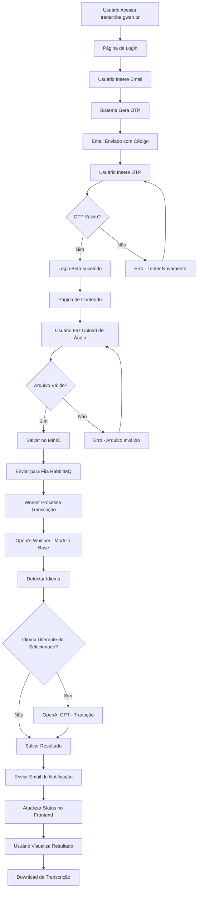
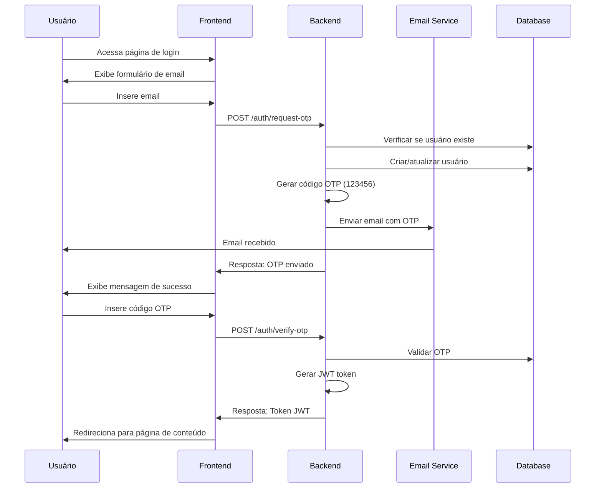
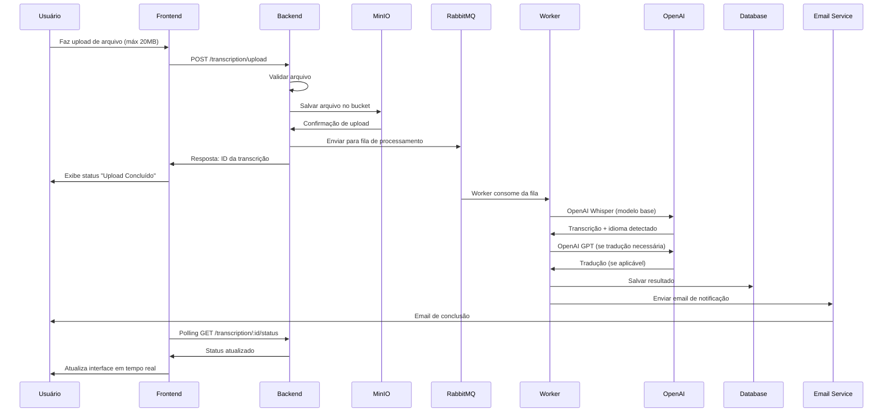
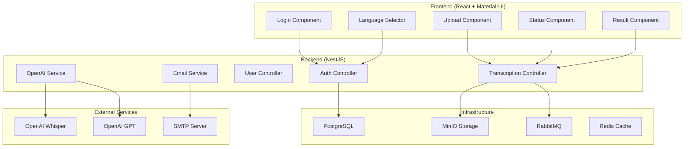
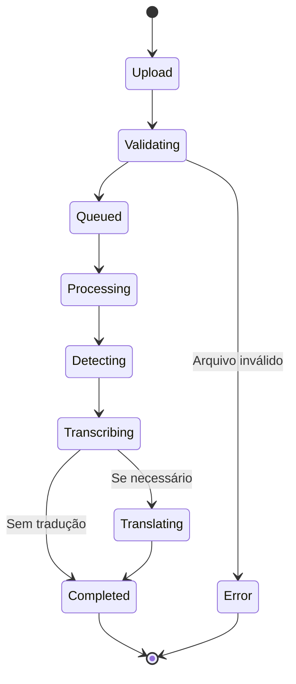
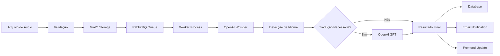
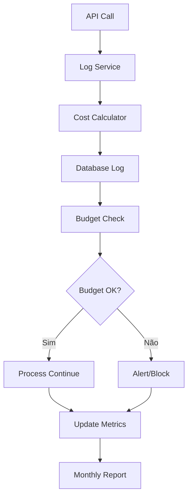
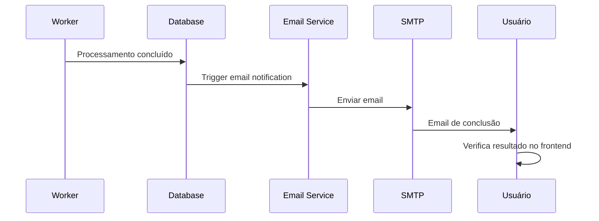
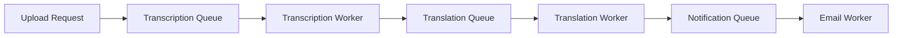
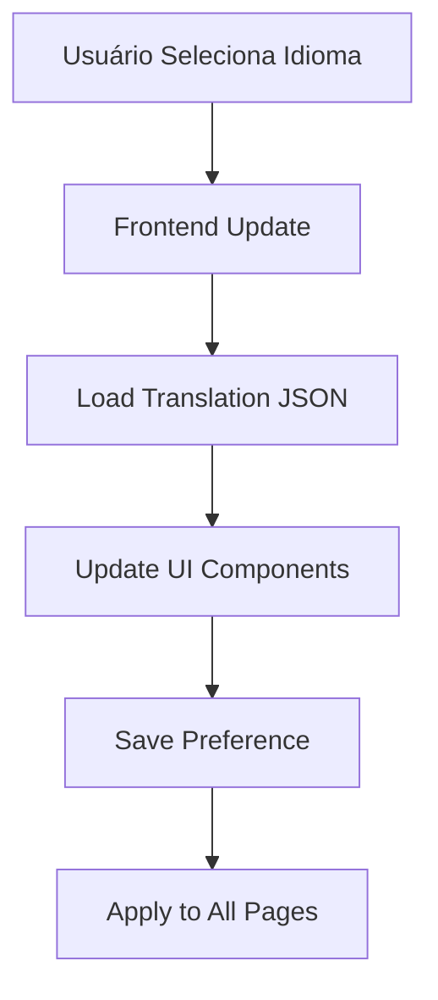

# Fluxo da Aplicação - Gwan Transcribe

## Diagramas Mermaid

### 1. Fluxo Geral da Aplicação

### 2. Fluxo de Autenticação OTP

### 3. Fluxo de Upload e Transcrição

### 4. Arquitetura de Componentes

### 5. Estados de Processamento

### 6. Fluxo de Dados

### 7. Monitoramento de Custos

### 8. Fluxo de Notificações

### 9. Estrutura de Filas

### 10. Fluxo de Internacionalização

---

## Resumo dos Fluxos

### **Autenticação**
1. Usuário acessa e insere email
2. Sistema gera OTP e envia por email
3. Usuário insere código e recebe JWT
4. Redirecionamento para página de conteúdo

### **Transcrição**
1. Upload de arquivo (máx 20MB)
2. Validação e salvamento no MinIO
3. Envio para fila RabbitMQ
4. Processamento assíncrono com OpenAI Whisper
5. Detecção de idioma e tradução se necessário
6. Notificação por email e atualização do frontend

### **Monitoramento**
1. Logs detalhados de todas as chamadas API
2. Controle de budget (R$ 100,00 mensal)
3. Métricas de uso e custos
4. Alertas quando próximo do limite

---

**Última atualização**: Agosto 2025  
**Versão**: 1.0 